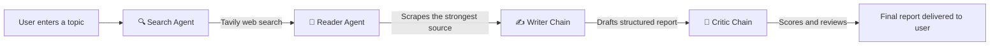

# 🔬 ResearchMind

### Multi Agent AI Research Pipeline

**Track 4: Agentic AI | Summer Skills Sprint Challenge 2026 | StarkAI Cohort | Techneeds, IGDTUW**


ResearchMind is a multi agent system where four specialized AI agents work together in sequence, searching the live web, reading the strongest source in depth, drafting a structured report, and critically reviewing it, so that a single research question turns into a complete, sourced, self reviewed report.

---

## 📌 Problem Statement

Doing real research on any topic today usually means opening a search engine, skimming through a dozen tabs, judging which sources are actually reliable, reading the useful ones in depth, and then manually pulling everything into one coherent write up. It is slow, and the quality depends entirely on how much time and patience the person has.

Asking a single large language model to just answer the question does not fix this. Without access to live information, a model's knowledge is frozen at its training cutoff, and it has no way to check the sources behind its own claims. It can also hallucinate details with total confidence, and nothing in that single call catches it.

ResearchMind's goal is to close that gap using an agentic workflow instead of one big prompt. Each agent is responsible for exactly one stage of the research process and hands its output to the next, mirroring how a person would actually research something: search, read, write, then review before trusting the result.

## 🧠 The Agentic Pipeline



| Agent | Role | Tooling |
|---|---|---|
| 🔍 **Search Agent** | Queries the live web for recent, reliable sources on the topic | Tavily Search API |
| 📖 **Reader Agent** | Picks the single strongest source and extracts its real content | Requests + BeautifulSoup (lxml) |
| ✍️ **Writer Chain** | Synthesizes the search results and scraped content into a structured, cited report | LangChain prompt chain |
| 🧐 **Critic Chain** | Independently reviews the report, scores it out of 10, and flags strengths and gaps | LangChain prompt chain |

Each agent is deliberately narrow in scope. The Search and Reader agents are true tool calling agents built on a hand written LangChain tool loop, not a single monolithic prompt, which means each one can decide for itself when and how to call its tool and can be swapped, tested, or upgraded independently of the rest of the pipeline.

## ⚙️ How It Works

1. The user enters a research topic in the console.
2. The **Search Agent** calls the `web_search` tool (Tavily) and returns titles, URLs, and snippets for the most relevant recent sources.
3. The **Reader Agent** reads those results, picks the single most promising URL, and calls the `scrape_url` tool to extract the actual page content, with retry logic for flaky network calls.
4. The **Writer Chain** combines the search summary and scraped content into a structured report: Introduction, Key Findings, Conclusion, and Sources.
5. The **Critic Chain** reviews that report on its own and returns a numeric score, listed strengths, listed gaps, and a one line verdict, so the person reading the report also sees an honest second opinion on how much to trust it.
6. All of this streams live into the interface: a progress rail, a per agent status card, and a running log, so nothing is a black box while it runs.

## ✨ Key Features

- **Provider agnostic LLM layer**: switch between OpenAI and Groq with one environment variable, no code changes.
- **Live pipeline visualization**: real time status per agent (waiting, running, complete) with a progress rail, not a static spinner.
- **Transparent live log**: a terminal style feed shows exactly what each agent is doing as it happens, useful for debugging and for demoing the system's reasoning.
- **Automated critique layer**: the report is never shown without a second, independent model pass scoring and challenging it first.
- **Parsed evaluation score**: the critic's score is extracted and rendered as a visual meter, not left buried in text.
- **Source aggregation**: every URL surfaced anywhere in the run is deduplicated and shown as clickable chips.
- **Exportable output**: download the final report as Markdown or plain text.
- **Session run history**: past topics run in the session are kept in the sidebar for quick reference.
- **Friendly error handling**: missing keys, exhausted quota, rate limits, and network failures all return a plain sentence explaining what to do, not a raw traceback.

## 📊 Evaluation

Evaluation happens on two levels in this project.

**Automated, per run**: the Critic Chain acts as a built in evaluator on every single report the system produces. It scores the report out of 10 against four criteria, accuracy, completeness, clarity, and reliability, and separately lists concrete strengths and concrete gaps rather than a single unexplained number. This means every output the user sees has already been through a critical second pass before it reaches them, and the score is visible, not hidden.

**Manual, during development**: the pipeline was tested across a range of topic types, including current events, scientific and technical subjects, and niche or narrow queries, to check three things: whether the Search Agent surfaced genuinely relevant and recent sources, whether the Reader Agent extracted meaningful content rather than boilerplate or navigation text, and whether the Writer Chain's report actually reflected the material gathered rather than the model's own prior knowledge. Failures at each stage were traced back to that specific agent rather than treated as one opaque pipeline failure, which is one of the main advantages of the agentic design over a single prompt approach.

## 🛠️ Tech Stack

- **Orchestration**: LangChain (1.x), custom tool calling loop
- **LLMs**: OpenAI (`gpt-4o-mini`) or Groq (`llama-3.3-70b-versatile`), switchable
- **Search**: Tavily Search API
- **Scraping**: Requests, BeautifulSoup4, lxml
- **Reliability**: Tenacity (retry logic on network calls)
- **Interface**: Streamlit
- **Config**: python-dotenv

## 🚀 Getting Started

**1. Clone and install dependencies**

```bash
git clone <your-repo-url>
cd researchmind
pip install -r requirements.txt
```

**2. Configure environment variables**

```bash
cp .env.example .env
```

Then fill in `.env`:

| Variable | Required | Description |
|---|---|---|
| `TAVILY_API_KEY` | Always | Powers the Search Agent |
| `LLM_PROVIDER` | Always | Set to `openai` or `groq` |
| `OPENAI_API_KEY` | If provider is `openai` | Your OpenAI key |
| `OPENAI_MODEL` | Optional | Defaults to `gpt-4o-mini` |
| `GROQ_API_KEY` | If provider is `groq` | Your Groq key |
| `GROQ_MODEL` | Optional | Defaults to `llama-3.3-70b-versatile` |

**3. Run the app**

```bash
streamlit run app.py
```

**4. Or test the pipeline directly from the terminal**, without the UI

```bash
python pipeline.py
```

## 🧭 Limitations and Future Work

- The Reader Agent currently reads a single source in depth per run. Extending it to synthesize across multiple scraped sources would improve coverage on complex topics.
- There is no persistent storage or vector database yet, so past reports are not searchable across sessions, only within the current one.
- The Critic Chain's score is generated by the same class of model doing the writing, so it is a useful second pass but not an external ground truth. A future version could compare against a held out evaluation set or human ratings.
- No automated test suite yet. Testing so far has been manual, across a range of topics.

## 🙌 Acknowledgments

Built as a capstone project for **Track 4: Agentic AI**, Summer Skills Sprint Challenge 2026, StarkAI cohort, hosted by Techneeds, IGDTUW.

## 📄 License

This project is licensed under the MIT License.
